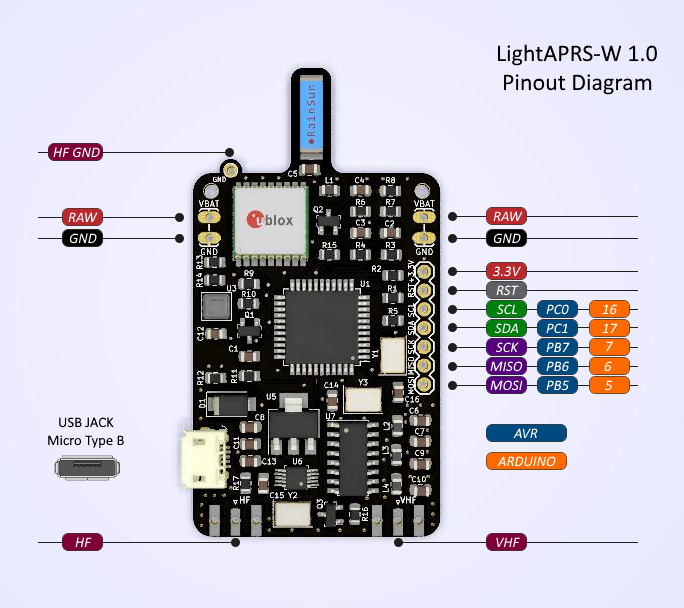
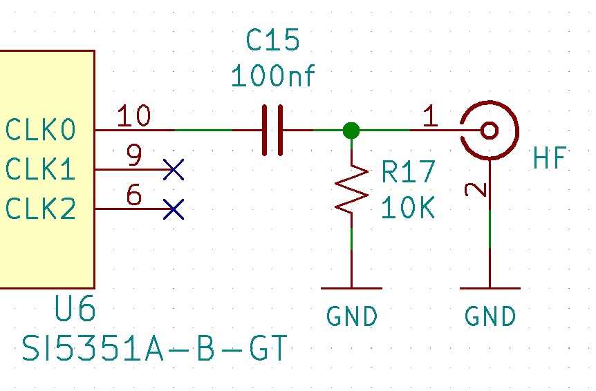
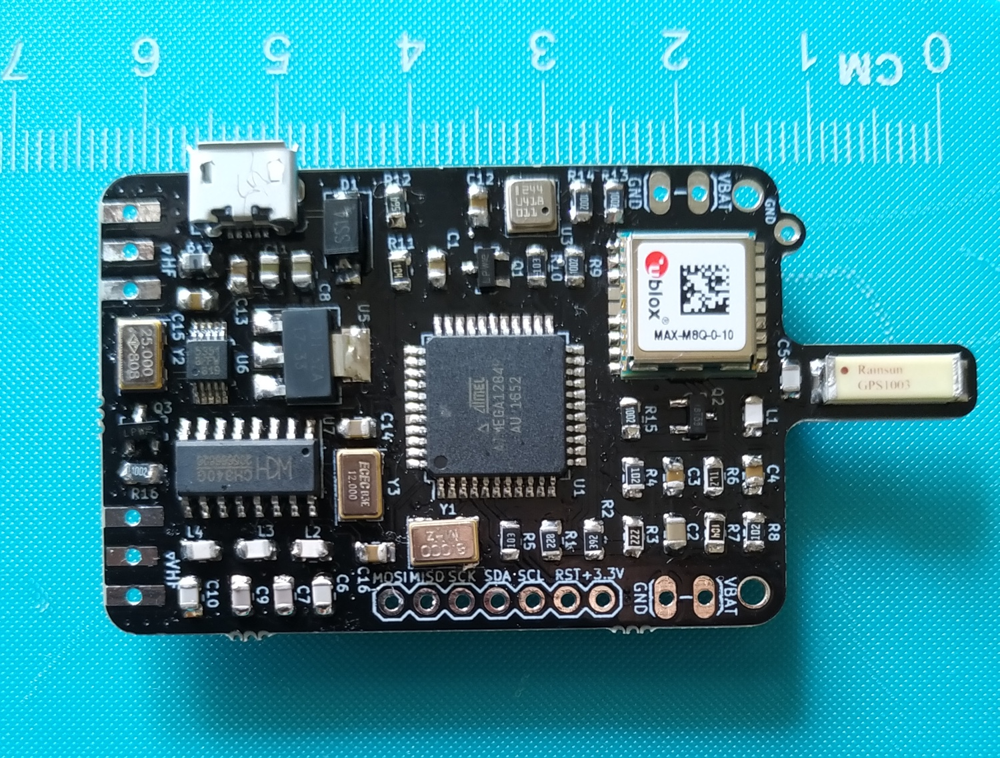
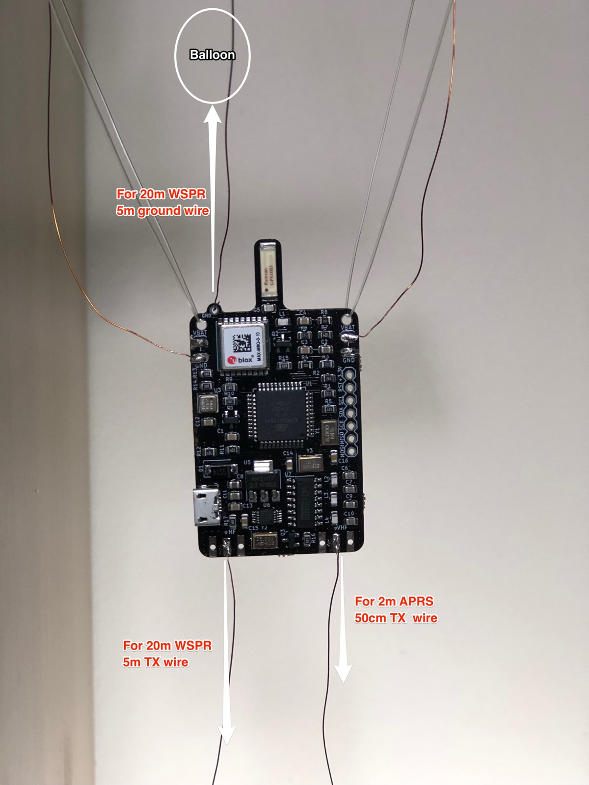
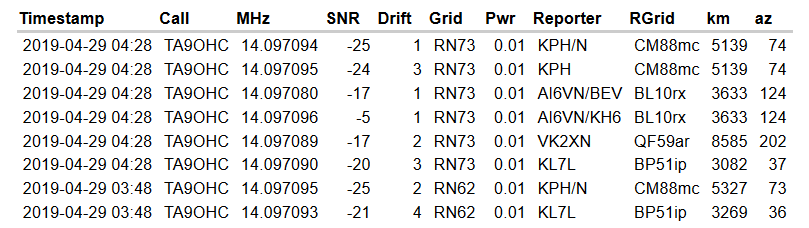
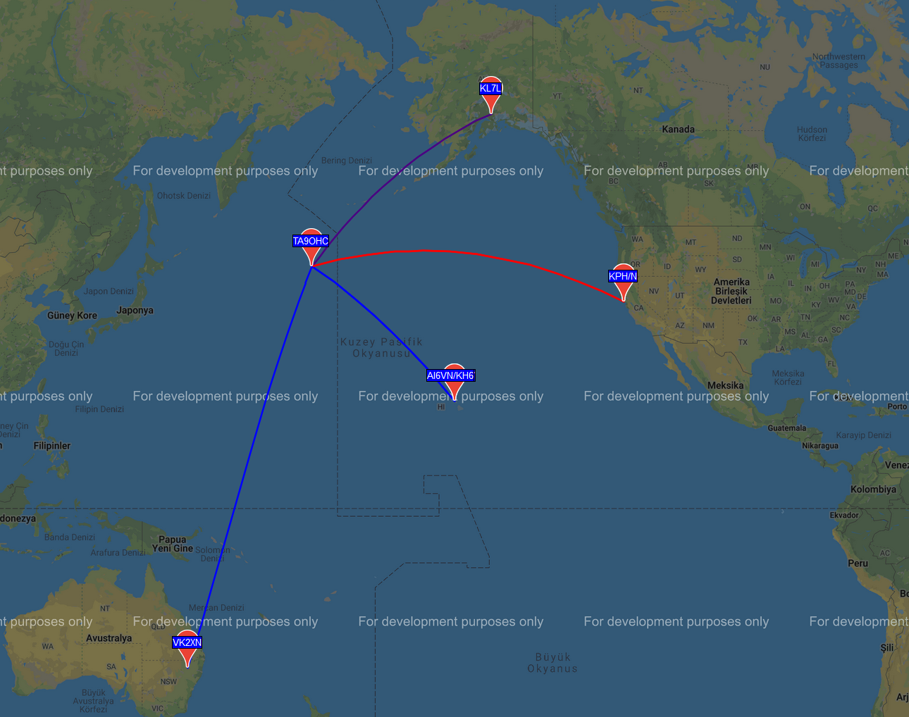

# LightAPRS WSPR Tracker

LightAPRS-W is an affordable, smallest, lightest, powerful and open source APRS tracker with WSPR. It makes tracking pico balloons simple and easy. 
It is able to report location, altitude, temperature and pressure to the internet ([APRS-IS](http://status.aprs2.net)) or direct to an amateur radio once a minute with a solar panel/super capacitors or just 4xAAA batteries. 
Because LightAPRS-W is open source you can add your own custom sensors via I2C/SPI pins.

LightAPRS-W is available on http://shop.qrp-labs.com/index.php?route=product/product&path=76&product_id=127 for order. If you don't need WSPR, than check out APRS only tracker [LightAPRS](https://github.com/lightaprs/LightAPRS-1.0)

**Important :** LightAPRS-W uses the amateur 2 meter (VHF) and 10m+ (HF) radio band which requires an amateur radio license to operate.
 
## Basic Features
 
- **Software** : Open Source
- **Weight** : 9 grams
- **Dimensions**    : 3.5 cm x 6 cm
- **IDE** : Arduino
- **Platform** : MightyCore
- **CPU** : Atmega1284P-AU
- **Flash** : 128 kB
- **Ram** : 16 kB
- **EEPROM** : 4 kB
- **Operating Frequency** : 8 Mhz
- **Operating Voltage** : 3.3 Volt
- **Input Voltage** : 4.5 (min) - 10 (max) Volt via usb or VBat pin
- **BOD** : 2.7 Volt
- **Sensor** : BMP180 (pressure and temperature)
- **VHF Radio Module** : [Dorji DRA818V](http://www.dorji.com/products-detail.php?ProId=55) (included)
- **VHF Radio Operating Frequency** : 144-146 Mhz (configurable by code)
- **VHF Low Pass Filter** : Available (7 elements)
- **VHF Radio Power**  : 0.5 Watt or 1 Watt (configurable by code)
- **VHF Power Consumption (TX)** : ~460 mA (0.5 Watt) / ~760 mA (1 Watt) (Automatically selected based on input voltage by code)
- **HF Radio Module** : [Si5351A-B-GT](https://www.silabs.com/products/timing/clocks/cmos-clock-generators/device.si5351a-b-gt) (included)
- **HF Radio Operating Frequency** : 2.5kHz - 200Mhz (configurable by code)
- **HF Low Pass Filter** : No

- **HF Radio Power**  : ~10mW
- **Power Consumption (Sleep)** : ~5 mA
- **GPS** : Ublox MAX-M8Q (GPS-GLONASS)
- **GPS Antenna Gain** : 4.3 dBi
- **Extended Pins** : I2C, SPI
- **USB Serial** : CH340G

## Configuration

To programme LightAPRS-W Tracker, all you need is a micro usb (B type) cable, a few installations and configurations.

### 1.Install CH340G Driver

The CH340 chip is used by a number of Arduino compatible boards (and by LightAPRS-W) to provide USB connectivity, you may need to install a driver. (If you have installed it before for a clone Android board, you don't have to install it again.)

Don't worry, it's really easy. Just download the following driver from sparkfun.com and install it.

- [Windows](https://cdn.sparkfun.com/assets/learn_tutorials/8/4/4/CH341SER.EXE)
- [Mac](https://cdn.sparkfun.com/assets/learn_tutorials/8/4/4/CH341SER_MAC.ZIP)
- [Linux](https://cdn.sparkfun.com/assets/learn_tutorials/8/4/4/CH341SER_LINUX.ZIP)

### 2.Install Arduino IDE

Download and install [Arduino IDE](https://www.arduino.cc/en/Main/Software). If you have already installed Arduino, please check for updates. Its version should be at least v1.8.7 or newer.

### 3.Install MightyCore

- Open the Arduino IDE.
- Open the **File > Preferences** menu item. [[Screenshot]](images/arduino-preferences-boards-manager-url.png)
- Enter the following URL in Additional Boards Manager URLs:
> https://mcudude.github.io/MightyCore/package_MCUdude_MightyCore_index.json
- Separate the URLs using a comma ( , ) if you have more than one URL
- Open the **Tools > Board > Boards Manager...** menu item. [[Screenshot]](images/arduino-tools-boards-manager.png)
- Wait for the platform indexes to finish downloading.
- Type "MightyCore" in search bar until you see the **MightyCore** entry and click on it. 
- Click **Install** .
- After installation is complete, close the **Boards Manager** window.

### 4.Configure MightyCore

- Open the **Tools > Board** menu item and select **ATMega1284** from the end of the list. [[Screenshot]](images/arduino-boards-manager-mightycore-select.png)
- After selecting **ATMega1284** you will see new options under **Tools** menu. Select these options as follows:
- Clock: 8 MHz external
- BOD: 2.7v
- Pinout: Standart
- Variant: 1284P
- Compiler LTO : Disabled 

### 5.Copy Libraries & Compile Source Code 

You are almost ready to programme LightAPRS-W Tracker :)

- First download the repository to your computer using green "[clone or download](https://github.com/lightaprs/LightAPRS-W-1.0/archive/master.zip)" button.
- There are more then one Arduino projects optimized for different use cases. For example if you are planning to use LightAPRS-W tracker for a pico balloon project, then use "[LightAPRS-W-pico-balloon](LightAPRS-W-pico-balloon)" folder.
- You will notice some folders in the "libraries" folder. You have to copy these folders (libraries) into your Arduino libraries folder on your computer. Path to your Arduino libraries:
- **Windows** : This PC\Documents\Arduino\libraries\
- **Mac** : /Users/\<username\>/Documents/Arduino/libraries/ 

**IMPORTANT :** LightAPRS-W uses more libraries than LightAPRS. So if you purchased LightAPRS and copied libraries before, do it again for LightAPRS-W. Otherwise you get compile error.

- Then open the *.ino file with Arduino IDE and change your settings (Callsign, SSID, comment, etc.)
- Click **Verify** 

### 6.Upload

- First attach an VHF antenna (at least 50cm monopole wire) to your tracker. Radio module may be damaged when not attaching an antenna, since power has nowhere to go. 
- Connect LightAPRS-W Tracker to your computer with micro USB cable. 
- If you have succesfully installed CH340G driver explained in the first step, you should see a COM port under **Tools->Port** menu item. Select that port. 

  

- Click **Upload**
- Your tracker is ready to launch :)
 
## Support

If you have any questions or need supoort, please contact support@lightaprs.com

## FAQ

**Q. I'm interested in pico balloon flights but I have no experience. What kind of balloon, solar panel, capacitor, etc. should I use?**

A. Please check out our wiki page Tips & Tricks for Pico Balloons:  https://github.com/lightaprs/LightAPRS-W-1.0/wiki/Tips-&-Tricks-for-Pico-Balloons

**Q. What kind of antenna do i need to use on LightAPRS-W?**

A. You can use any type. For airborne projects (such as pico balloons) we suggest quarter wave monopole antenna for VHF (2m APRS) becuase this makes your payload lighter. So just cut a light 50 cm. wire and solder it to antenna footprint (VHF) Since your payload is airborn and wavelenght is 2 meters, you don't need a wire for ground.

But for HF length of antenna depends on your band chose for WSPR. For example if it is 20 meters, you need 5m for TX RF output and 5m for ground. Tie one end to the balloon and solder the other end to the groundplane of the PCB. Then solder another 5m of wire to the TX RF output on the PCB, and let it hang below.

During 20m WSPR tests on a pico balloon, we experienced LightAPRS-W beacons heard from 8.585 km. away as follows:

Also check out Tom's (W5KUB) web site (http://tmedlin.com/balloon-3/) for a successful 20m pico balloon launch with LightAPRS-W.

**APRS Tracking :** https://aprs.fi/#!mt=roadmap&z=11&call=a%2FW5KUB-11&timerange=604800&tail=604800

**WSPR Tracking :** https://aprs.fi/#!mt=roadmap&z=11&call=a%2FW5KUB-10&timerange=604800&tail=604800

**Q. But I want to use rubber duck antenna. Is it possible?**

A. Yes. But you need a pcb type SMA connector (male or female) as follows:

**Q. I would like to use it as a car tracker is it possible to use an external antenna?**

A. Yes. But you also need a "n" type connector (n to SMA) along with the SMA connector as follows:

We have tested it for VHF (2m APRS) with Midland NW-2000 and for HF (20m WSPR) with Diamond HF20FX worked fine :)

